# 🔒 NetVault NOC

[](https://www.python.org/)
[](https://flask.palletsprojects.com/)
[](https://git-scm.com/)
[](LICENSE)
[](https://github.com/OneByJorah)


---

## 📋 Overview

**NetVault NOC** is a comprehensive, open-source Linux-based platform for network configuration backup, file transfer, and device management. Designed for Network Operations Centers (NOCs), it provides automated config backup, FTP/SFTP file transfer, TFTP device config push, oxidized for multi-vendor device backup, git-based version control, cloud sync integration, and a complete web interface for configuration management.

> **Built with ❤️ by [OneByJorah](https://github.com/OneByJorah) for NOC automation and network operations.**

---

## 🏗️ Architecture

### High-Level System Architecture

```mermaid
flowchart TB
    subgraph Frontend["Web UI / API"]
        WEB[Web Interface<br/>Flask + HTML/CSS/JS]
        API[REST API<br/>Flask Blueprint]
    end

    subgraph Services["Core Services"]
        FTP[VSFTPD<br/>FTP/FTPS Server]
        SFTP[OpenSSH<br/>SFTP Support]
        TFTP[TFTP Server<br/>tftpd-hpa]
        OXI[Oxidized<br/>Ruby Network Config Backup]
        WEBAPI[Oxidized Web<br/>REST API + UI]
    end

    subgraph Git["Version Control"]
        GIT[Git Repository<br/>Config History + Git Blame]
    end

    subgraph Cloud["Cloud Sync"]
        RCL[Rclone<br/>Cloud Storage Sync<br/>S3/Google Drive/OneDrive]
    end

    subgraph Backup["Backup Pipeline"]
        direction TB
        PUSH[TFTP Push<br/>Cisco IOS, JunOS, Arista, etc.]
        RESTORE[Config Restore<br/>From Git + FTP]
        COMPARE[Diff Viewer<br/>Config Changes Analysis]
        ALERT[Alert System<br/>Config Change Detection]
    end

    subgraph Webhooks["Webhooks & Integration"]
        WEBHOOK[Webhooks<br/>Slack, Teams, Discord]
    end

    subgraph Storage["Storage Backend"]
        S3[S3-Compatible<br/>MinIO, AWS S3, GCS]
        LOCAL[Local Filesystem<br/>/var/lib/netvault/backup]
    end

    WEB <--> API
    API <--> FTP
    API <--> SFTP
    API <--> TFTP
    API <--> OXI
    API <--> WEBAPI
    API <--> GIT
    API <--> RCL
    API <--> PUSH
    API <--> RESTORE
    API <--> COMPARE
    API <--> ALERT
    API <--> WEBHOOK
    OXI <--> S3
    OXI <--> LOCAL
    RCL <--> S3
    RCL <--> LOCAL

    style Frontend fill:#1a237e,stroke:#3f51b5,stroke-width:2px,color:#ffffff
    style Services fill:#2e7d32,stroke:#4caf50,stroke-width:2px,color:#ffffff
    style Git fill:#e65100,stroke:#ff9800,stroke-width:2px,color:#ffffff
    style Cloud fill:#01579b,stroke:#0288d1,stroke-width:2px,color:#ffffff
    style Backup fill:#b71c1c,stroke:#f44336,stroke-width:2px,color:#ffffff
    style Webhooks fill:#4a148c,stroke:#9c27b0,stroke-width:2px,color:#ffffff
    style Storage fill:#0288d1,stroke:#01579b,stroke-width:2px,color:#ffffff
```



---

## 🖼️ Screenshots

<div align="center">

### Dashboard Overview

*Main dashboard showing device inventory, recent backups, and quick actions*

---

### Device Inventory

*Complete device inventory with status, last backup, and connection info*

---

### Config Backup

*Config backup interface with schedule configuration and device selection*

---

### Config Diff Viewer

*Side-by-side config comparison with change highlighting and blame*

---

### Alert History

*Alert timeline showing config change notifications and webhooks*

---

### Cloud Sync

*Cloud storage sync configuration and status*

</div>

---

## ✨ Key Features

| Feature | Description |
|---------|-------------|
| 🔄 **Automated Config Backup** | Scheduled backup of network device configurations (Cisco IOS, JunOS, Arista, FortiOS, MikroTik, and 130+ OS types) |
| 📁 **FTP/FTPS Server** | Full-featured vsftpd server with passive mode, SSL/TLS encryption, and user management |
| 🔐 **SFTP Support** | OpenSSH SFTP server for secure file transfer and config storage |
| 📤 **TFTP Push** | tftpd-hpa server for pushing configurations to Cisco IOS, JunOS, and other devices |
| 🧪 **Oxidized Integration** | Full integration with oxidized for multi-vendor config backup with REST API and web UI |
| 🌐 **Git Version Control** | Git-based config versioning with blame tracking per device and change history |
| ☁️ **Cloud Sync** | rclone-based sync to S3, Google Drive, OneDrive, Backblaze B2, and other cloud storage |
| 🌍 **Oxidized Web UI** | Web interface for oxidized with device discovery, backup scheduling, and config management |
| 🔔 **Alert System** | Config change detection with Slack, Teams, Discord, and email notifications |
| 📊 **Diff Viewer** | Side-by-side config comparison with highlighting of added, removed, and modified lines |
| 📜 **Git Blame** | Per-line authorship tracking showing who made each config change and when |
| 📦 **REST API** | Full REST API for programmatic access to backup, restore, compare, and sync operations |
| 📱 **Responsive Web UI** | Modern, responsive web interface built with Flask templates |
| 🎛️ **Schedule Management** | Cron-based scheduling for automated backups with configurable frequency |

---

## 📁 Project Structure

```
NetVault-NOC/
├── README.md                   # This documentation
├── LICENSE                     # MIT License
├── requirements.txt            # Python dependencies
├── setup.py                    # Python package setup
├── app/                       # Main application code
│   ├── __init__.py
│   ├── config.py              # Configuration and settings
│   ├── models.py              # Database models
│   ├── routes/                # API route handlers
│   │   ├── __init__.py
│   │   ├── devices.py         # Device CRUD operations
│   │   ├── backup.py          # Backup scheduling and execution
│   │   ├── restore.py         # Config restore from Git/FTP
│   │   ├── compare.py         # Config diff viewer
│   │   ├── alerts.py          # Alert management and webhooks
│   │   ├── sync.py            # Cloud sync operations
│   │   └── api.py             # Main REST API endpoints
│   ├── services/              # Core services
│   │   ├── __init__.py
│   │   ├── oxidized.py        # Oxidized integration
│   │   ├── vsftpd.py          # FTP server management
│   │   ├── sftp.py            # SFTP server management
│   │   ├── tftp.py            # TFTP server management
│   │   ├── git.py             # Git operations and blame
│   │   ├── cloud.py           # rclone cloud sync
│   │   └── notifications.py    # Alert notifications
│   ├── utils/                 # Utility functions
│   │   ├── __init__.py
│   │   ├── parsers.py         # Config parsing and diff
│   │   ├── validators.py      # Input validation
│   │   ├── formatters.py      # Config formatting and pretty-printing
│   │   └── schedulers.py      # Cron scheduler management
│   └── templates/             # Web UI templates
│       ├── base.html          # Base template
│       ├── index.html         # Dashboard
│       ├── devices.html       # Device inventory
│       ├── backup.html        # Config backup
│       ├── restore.html       # Config restore
│       ├── compare.html       # Diff viewer
│       ├── alerts.html        # Alert history
│       ├── sync.html          # Cloud sync
│       └── login.html         # Login page
├── tests/                     # Unit and integration tests
│   ├── conftest.py            # Test fixtures
│   ├── test_api.py            # API tests
│   ├── test_routes.py         # Route tests
│   └── test_services.py       # Service tests
├── docs/                     # Documentation
│   ├── dashboard.png          # Dashboard screenshot
│   ├── devices.png            # Device inventory screenshot
│   ├── backup.png             # Config backup screenshot
│   ├── diff.png               # Diff viewer screenshot
│   ├── alerts.png             # Alert history screenshot
│   └── cloud-sync.png         # Cloud sync screenshot
├── scripts/                  # Utility scripts
│   ├── start.sh               # Startup script
│   ├── stop.sh                # Stop script
│   ├── restart.sh             # Restart script
│   ├── backup.sh              # Manual backup script
│   ├── restore.sh             # Manual restore script
│   └── sync.sh                # Cloud sync script
└── config/                   # Configuration files
    ├── default.conf           # Default configuration
    ├── example.xml            # VSFTPD config example
    ├── example.tftpd.conf    # TFTP config example
    └── example.rclone.conf    # Rclone config example
```

---

## ⚡ Quick Start

### Installation

```bash
# Clone the repository
git clone https://github.com/OneByJorah/NetVault-NOC.git
cd NetVault-NOC

# Install dependencies
pip install -r requirements.txt

# Run migrations
flask db upgrade

# Create admin user
python manage.py init-admin
```

### Configuration

Edit `config/default.conf`:

```yaml
# Server
SERVER_NAME: netvault.local
SECRET_KEY: your-secret-key

# Database
DATABASE_URL: sqlite:///netvault.db

# FTP Server
FTP_ENABLED: true
FTP_HOST: 127.0.0.1
FTP_PORT: 21
FTP_USER: netvault
FTP_PASS: netvault123

# SFTP Server
SFTP_ENABLED: true
SFTP_HOST: 127.0.0.1
SFTP_PORT: 22

# TFTP Server
TFTP_ENABLED: true
TFTP_HOST: 127.0.0.1
TFTP_PORT: 69
TFTP_ROOT: /var/lib/netvault/tftp

# Oxidized
OXIDIZED_ENABLED: true
OXIDIZED_URL: http://localhost:8080
OXIDIZED_API_KEY: your-api-key

# Git
GIT_ENABLED: true
GIT_REPO: /var/lib/netvault/configs
GIT_BRANCH: main

# Cloud Sync
CLOUD_SYNC: false
RCLONE_CONFIG: /etc/netvault/rclone.conf
```

### Running the Application

```bash
# Development
flask run --host=0.0.0.0 --port=5000

# Production
gunicorn --workers=4 --bind=0.0.0.0:5000 --timeout=120 app:create_app()
```

### Accessing the Web UI

```
http://localhost:5000
```

---

## 🔧 Configuration

### VSFTPD (FTP/FTPS Server)

```bash
# Create configuration
sudo vim /etc/vsftpd.conf

# Key settings
listen=YES
listen_ipv6=YES
anonymous_enable=NO
local_enable=YES
write_enable=YES
allow_writeable_dirs=YES
ssl_enable=YES
require_ssl_reuse=NO
force_ssl_logins=YES
ssl_cert_file=/etc/ssl/certs/ssl-cert-snakeoil.pem
ssl_key_file=/etc/ssl/private/ssl-cert-snakeoil-key.pem
pasv_min_port=30000
pasv_max_port=30010
```

### OpenSSH (SFTP Server)

```bash
# SSH configuration
sudo vim /etc/ssh/sshd_config

# Key settings
Port 22
PermitRootLogin no
PasswordAuthentication yes
PubkeyAuthentication yes
AllowAgentForwarding yes
PermitTunnel yes
X11Forwarding yes
```

### tftpd-hpa (TFTP Server)

```bash
# TFTP configuration
sudo vim /etc/tftpd-hpa/tftpd-hpa.conf

# Key settings
address 0.0.0.0
port 69
user netvault
tftp_root /var/lib/netvault/tftp
timeout 30
socket_timeout 60
verbose
```

### Oxidized (Config Backup)

```bash
# Oxidized configuration
sudo vim /etc/oxidized/oxidized.yml

# Key settings
nodes:
  cisco:
    protocol: ssh
    vars:
      - name: username
        prompt: .*
        value: admin
      - name: password
        prompt: .*
        value: your-password
    commands:
      - show running-config

schedule:
  default:
    every: 24h
    interval: 1h
    max_attempts: 3
```

### Git (Version Control)

```bash
# Initialize git repository
cd /var/lib/netvault/configs
git init
git config user.email "admin@netvault.local"
git config user.name "Admin"
git branch -M main
```

### Rclone (Cloud Sync)

```bash
# Create rclone configuration
rclone config
```

---

## 🔍 API Reference

### Base URL

```
http://localhost:5000/api/v1
```

### Endpoints

| Endpoint | Method | Description |
|----------|--------|-------------|
| `/api/v1/devices` | GET | List all devices |
| `/api/v1/devices/<device_id>` | GET | Get device details |
| `/api/v1/devices/<device_id>` | PUT | Update device |
| `/api/v1/devices/<device_id>` | DELETE | Delete device |
| `/api/v1/backup` | POST | Trigger backup |
| `/api/v1/backup/schedule` | GET | List backup schedules |
| `/api/v1/backup/schedule` | POST | Create schedule |
| `/api/v1/backup/schedule/<id>` | DELETE | Delete schedule |
| `/api/v1/restore` | POST | Restore config |
| `/api/v1/restore/<commit_id>` | GET | Get restore status |
| `/api/v1/compare` | POST | Compare configs |
| `/api/v1/alerts` | GET | List alerts |
| `/api/v1/alerts/<id>` | GET | Get alert details |
| `/api/v1/alerts` | POST | Create alert |
| `/api/v1/alerts/<id>` | DELETE | Delete alert |
| `/api/v1/sync` | POST | Trigger cloud sync |
| `/api/v1/sync/status` | GET | Get sync status |
| `/api/v1/ftp/files` | GET | List FTP files |
| `/api/v1/ftp/files/<path>` | GET | Get file metadata |
| `/api/v1/ftp/files/<path>` | PUT | Upload file |
| `/api/v1/ftp/files/<path>` | DELETE | Delete file |
| `/api/v1/tftp/push` | POST | Push config via TFTP |
| `/api/v1/oxidized/nodes` | GET | Get oxidized nodes |
| `/api/v1/oxidized/nodes/<name>` | GET | Get node details |

### Examples

#### Trigger Backup

```bash
curl -X POST http://localhost:5000/api/v1/backup \
  -H "Authorization: Bearer YOUR_API_KEY" \
  -d '{"device": "cisco-1", "mode": "full"}'
```

#### Compare Configs

```bash
curl -X POST http://localhost:5000/api/v1/compare \
  -H "Authorization: Bearer YOUR_API_KEY" \
  -d '{"base": "v1", "compare": "v2"}'
```

#### Restore Config

```bash
curl -X POST http://localhost:5000/api/v1/restore \
  -H "Authorization: Bearer YOUR_API_KEY" \
  -d '{"commit": "abc123", "target": "cisco-1"}'
```

---

## 📊 Monitoring

### System Health

```bash
# Check service status
sudo systemctl status netvault

# Check database connection
flask db verify

# Check FTP server
vsftpd -version

# Check TFTP server
tftpd-hpa --version
```

### Logs

```bash
# Application logs
sudo tail -f /var/log/netvault/app.log

# FTP logs
sudo tail -f /var/log/vsftpd.log

# TFTP logs
sudo tail -f /var/log/tftpd-hpa.log

# Oxidized logs
sudo tail -f /var/log/oxidized.log
```

---

## 🔒 Security

### Network Security

- FTP: Passive mode with port range restriction
- SFTP: SSH-only file transfer with key-based authentication
- TFTP: Restricted to trusted network segments

### Authentication

- API: Bearer token authentication
- Web UI: Session-based authentication with JWT
- FTP: User-based authentication

### Encryption

- SFTP: SSH encryption (AES-256)
- FTPS: SSL/TLS encryption (128-bit minimum)
- API: HTTPS with TLS 1.2+

---

## 📚 Dependencies

### Python

```
Flask>=2.2.0
Flask-SQLAlchemy>=3.0.0
Flask-Migrate>=3.1.0
Flask-CORS>=4.0.0
PyYAML>=6.0
bcrypt>=4.0.0
paramiko>=3.0.0
fabric>=2.7.0
rclone>=1.63.0
```

### Ruby (for Oxidized)

```
oxidized>=0.12.0
```

### System Dependencies

```
vsftpd>=3.0.0
tftpd-hpa>=1.7.0
openssh-server>=8.0
git>=2.30.0
```

---

## 🤝 Contributing

1. Fork the repository
2. Create a feature branch (`git checkout -b feature/amazing-feature`)
3. Commit your changes (`git commit -m 'Add amazing feature'`)
4. Push to the branch (`git push origin feature/amazing-feature`)
5. Open a Pull Request

---

## 📄 License

MIT License — free to use, modify, and distribute.

---

## 📞 Support

For issues or questions, please open an issue on GitHub:

https://github.com/OneByJorah/NetVault-NOC/issues

---

## 🙏 Acknowledgments

- **Oxidized**: Config backup engine by [Oxidized Team](https://github.com/ytti/oxidized)
- **VSFTPD**: FTP server by [vsftpd](https://vsftpd.beasts.org/)
- **tftpd-hpa**: TFTP server by [tftpd-hpa](https://github.com/JohnBacon/tftpd-hpa)

---

**Made with ❤️ by [OneByJorah](https://github.com/OneByJorah)**
